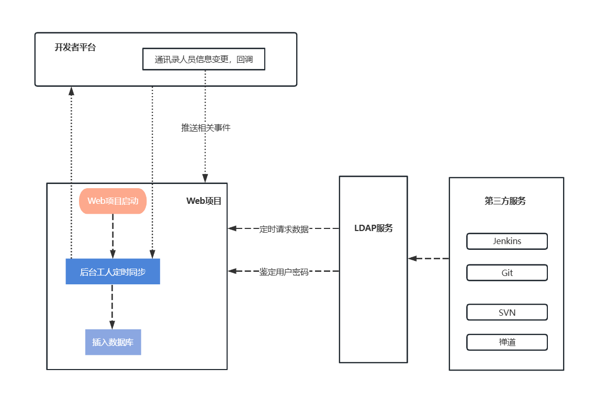
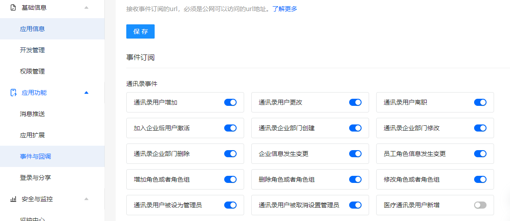
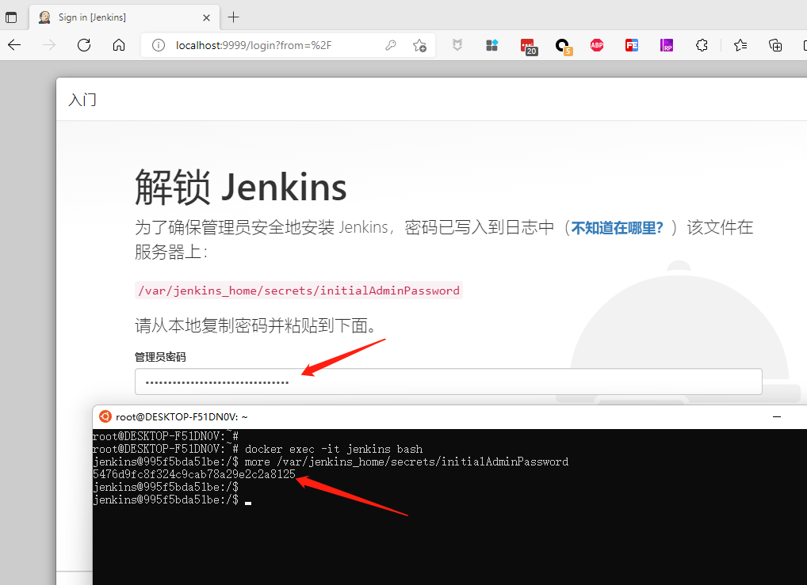
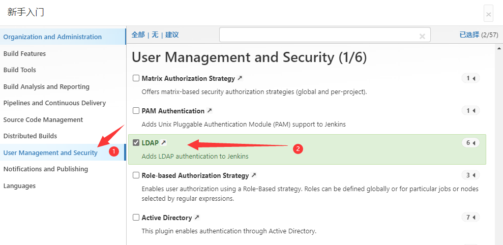
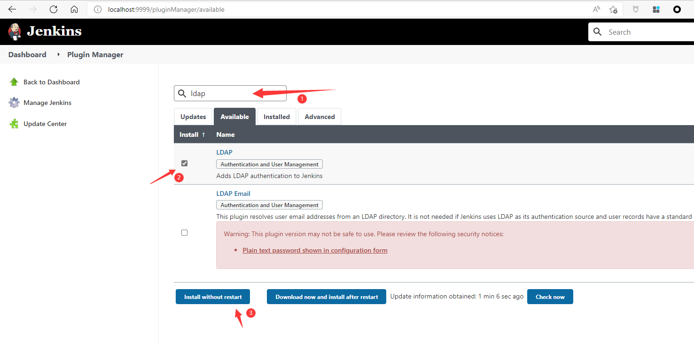
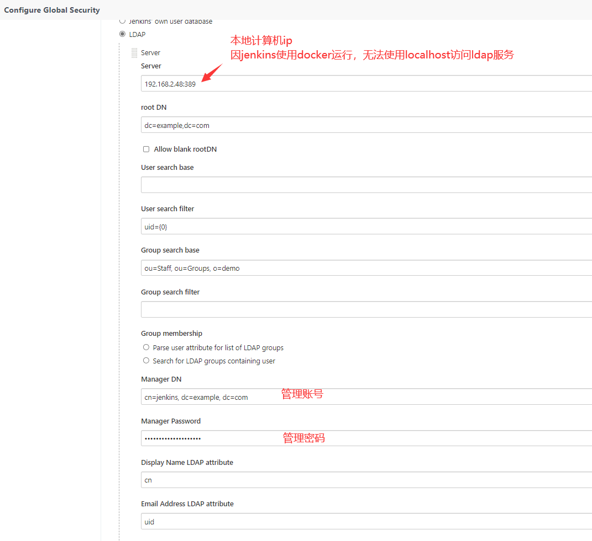

# 基于钉钉通讯录搭建LDAP服务

## 流程



## 同步策略

- Web服务端

  启动后等待30秒，从钉钉开放平台获取部门、人员数据

  若部门/人员新增，本地数据库中不存在，则同步至数据库中，并同步部门人员关系

  - 默认同步后，若人员为该组织的管理人员或部门管理人员，则在服务端中是管理员身份，可查看当前部门及下属部门人员信息，为下属部门人员开通账号。
- 默认同步后的人员账号，根据姓名生成；如 `张三` ，生成的账号为 `zhangsan` ，**若非管理员身份，账号默认禁用** ，需要上级管理人员为该账号开通。
  - 开通后的账号，可在钉钉自建H5应用中修改密码，只有修改了密码，该账号方可在各平台使用。
  - 当钉钉通讯录中发生变更时，由钉钉开发者平台回调，向Web服务端推送相关事件消息，处理相关逻辑。

- LDAP

  - 每一分钟从服务端同步一次部门/人员数据
  - 若服务端无法正常访问，则使用最近一次同步数据
  - 默认只同步开通账号的人员，开通后，若需要在各平台正常使用，需要在钉钉自建H5应用中修改初始密码

## 钉钉回调事件配置



## 钉钉权限配置
| 分组       | 权限信息             | 接口                                                         | 权限点code                  |
| ---------- | -------------------- | ------------------------------------------------------------ | --------------------------- |
| 个人权限   | 个人手机号信息       | 获取用户个人信息                                             | Contact.User.mobile         |
| 通讯录管理 | 企业员工手机号信息   | 查询用户详情                                                 | fieldMobile                 |
| 通讯录管理 | 邮箱等个人信息       | 查询用户详情                                                 | fieldEmail                  |
| 通讯录管理 | 通讯录部门信息读权限 | 获取部门详情<br/>获取指定用户的所有父部门列表<br />获取部门列表<br />获取指定部门的所有父部门列表<br />获取子部门ID列表<br />获取角色组列表<br />获取角色列表 | qyapi_get_department_list   |
| 通讯录管理 | 成员信息读权限       | 获取用户高管模式设置<br/>查询用户详情<br/>获取部门用户userid列表<br/>获取管理员列表<br/>获取员工人数<br/>根据unionid查询用户<br/>获取管理员通讯录权限范围<br/> | qyapi_get_member            |
| 通讯录管理 | 通讯录部门成员读权限 | 获取部门用户详情<br />获取部门用户基础信息<br />获取角色详情<br />获取指定角色的员工列表<br /> | qyapi_get_department_member |

## 源码运行

``` bash
# 1、进入相关目录
cd docker-compose

# 2、修改configs目录下appsettings.json中钉钉相关配置

# 3、使用docker compose运行
docker compose up -d

```


## Jenkins
### 使用Docker运行jenkins

``` bash
# 使用docker运行jenkins，并设置插件源为清华大学
# Windows下运行，请将每后结尾的 \ 替换为 ^
docker run -itd  --name jenkins --privileged --restart always --privileged=true \
-e TZ=Asia/Shanghai \
-e JENKINS_UC_DOWNLOAD=https://mirrors.tuna.tsinghua.edu.cn/jenkins/updates/update-center.json \
-p 9999:8080 -p 50000:50000 \
-v /d/ldap-docker-config/jenkins:/var/jenkins_home \
jenkins/jenkins:lts-jdk11

```

打开浏览器进入jenkins界面 http://localhost:9999    
输入密码

``` bash
# 进入jenkins容器
docker exec -it jenkins bash

# 查看jenkins默认密码，使用默认密码登录jenkins
more /var/jenkins_home/secrets/initialAdminPassword


```


### 安装LDAP插件

- 初次进入自由选择插件时选择


- 进入Jenkins后选择



### Jenkins设置LDAP

- Server : localhost:389
- root DN : dc=example,dc=com
- Group search base : ou=Staff, ou=Groups, o=demo
- Manager DN : cn=jenkins, dc=example, dc=com
- Display Name LDAP attribute : cn
- Email Address LDAP attribute : uid



## 参考

ldap-server源码参考 [xiaoquqi](https://github.com/xiaoquqi)/**[virtual-ldap](https://github.com/xiaoquqi/virtual-ldap)**

