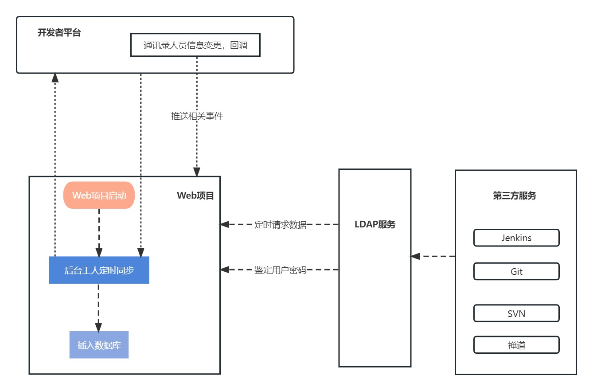

# 基于钉钉、企业微信通讯录搭建LDAP服务

## 运行环境

- 后端
  -  `ASP.NET Core 8 `
  - `Volo.Abp`

- 前端 `nodejs 18.12.1`

## Docker镜像
- [ldap-contacts-sync](https://hub.docker.com/r/programmerzheng/ldap-contacts-sync) 同步通讯录后端服务
- [ldap-server](https://hub.docker.com/r/programmerzheng/ldap-server) LDAP服务端
## 项目结构

```bash
|-- .github						利用GitHub中Actions功能编译Docker镜像
|-- ContactsSync				后端程序，同步通讯录
|-- docker-compose				docker-compose方式运行依赖项
    |-- configs 				配置文件目录
    |   |-- appsettings.json	后端程序配置文件
    |   |-- config.js			LDAP服务配置文件
    |-- scripts					MySQL脚本文件，用于初始化数据库表结构
    |-- docker-compose.yaml		docker-compose启动脚本
|-- ldap-server					LDAP服务程序
|-- screenshots					存放markdown引用图片
|-- .gitignore
```

## 流程



## 同步策略

- Web服务端

  启动后等待30秒，从钉钉/企业微信开放平台获取部门、人员数据

  若部门/人员新增，本地数据库中不存在，则同步至数据库中，并同步部门人员关系

  - 默认同步后，若人员为该组织的管理人员或部门管理人员，则在服务端中是管理员身份，可查看当前部门及下属部门人员信息，为下属部门人员开通账号。
- 默认同步后的人员账号，根据姓名生成；如 `张三` ，生成的账号为 `zhangsan` ，**如果为非管理员身份，账号默认禁用** ，需要上级管理人员为该账号开通。
  - 开通后的账号，可在自建H5应用中修改密码，只有修改了密码，该账号方可在各平台使用。
  - 当通讯录中发生变更时，由开发者平台回调，向Web服务端推送相关事件消息，处理相关逻辑。

- LDAP

  - 每一分钟从服务端同步一次部门/人员数据
  - 若服务端无法正常访问，则使用最近一次同步数据
  - 默认只同步开通账号的人员，开通后，若需要在各平台正常使用，需要在自建H5应用中修改初始密码


## 钉钉开放平台配置

[钉钉开放平台详情](README_DingDing.md)


## 企业微信开放平台配置

[企业微信开放平台详情](README_WorkWeixin.md)


## 源码运行

``` bash
# 1、进入相关目录
cd docker-compose

# 2、修改configs目录下appsettings.json中钉钉相关配置

# 3、使用docker compose运行
docker compose up -d
```


## 常见第三方软件对接

[常见第三方软件对接详情](README_ThirdParty.md)


## 问题

#### 配置完成，域账号无法登录

1、若账号所属用户在钉钉组织架构中是部门管理人员，或钉钉平台的管理员/子管理员，则默认账号为启用状态，否则为禁用状态，检查数据库中`users`表的`AccountEnable`字段是否为 `1(true)`

2、管理人员账号虽然默认启用了，但因初始密码为`123456`，为不安全密码，默认密码为未初始化状态，需要修改密码，在钉钉的应用中找到相关应用，修改密码即可，也可以将数据库中`users`表的`PasswordInited`字段修改为`1(true)`，则可以正常登录

## 参考

ldap-server源码参考 [xiaoquqi](https://github.com/xiaoquqi)/**[virtual-ldap](https://github.com/xiaoquqi/virtual-ldap)**

## Thanks

[](https://www.jetbrains.com/?from=virtual-ldap)

