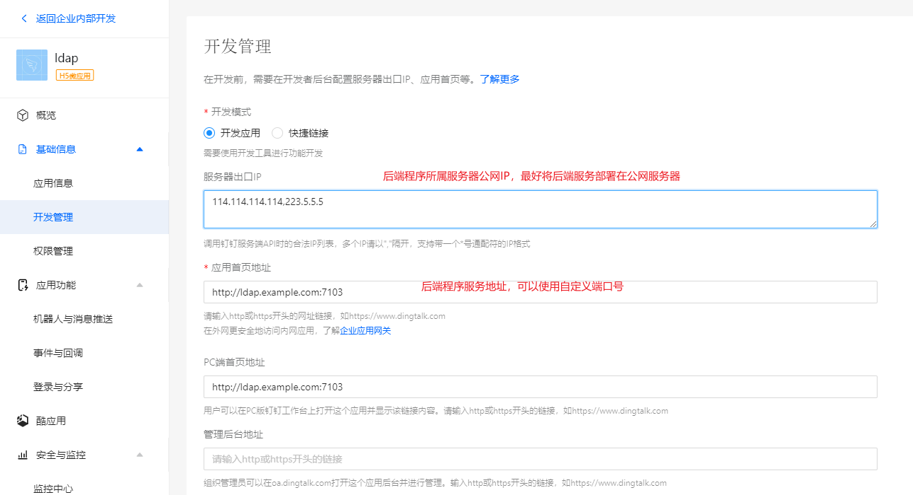
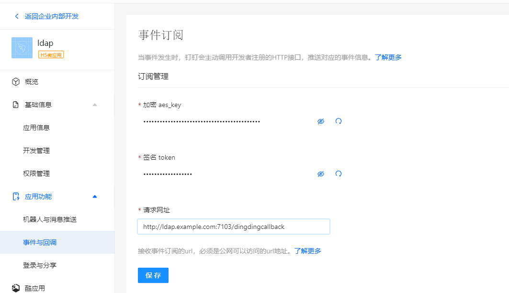
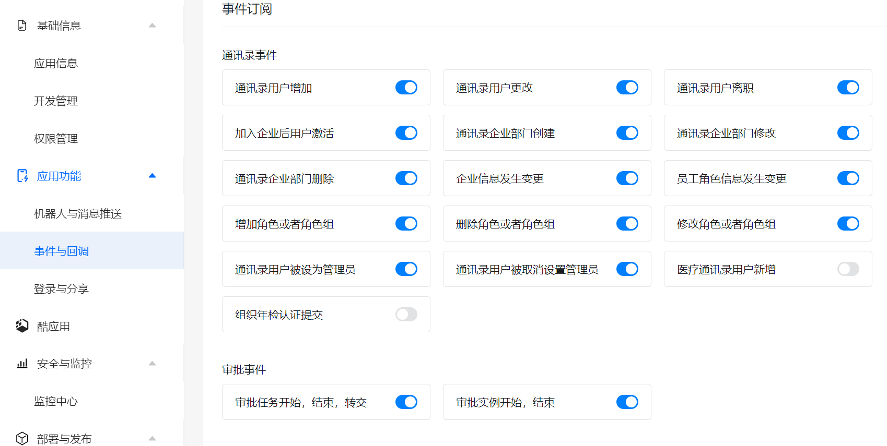

## 钉钉开放平台配置

### 开发管理配置

### 权限配置

| 分组       | 权限信息             | 接口                                                         | 权限点code                  |
| ---------- | -------------------- | ------------------------------------------------------------ | --------------------------- |
| 个人权限   | 个人手机号信息       | 获取用户个人信息                                             | Contact.User.mobile         |
| 通讯录管理 | 企业员工手机号信息   | 查询用户详情                                                 | fieldMobile                 |
| 通讯录管理 | 邮箱等个人信息       | 查询用户详情                                                 | fieldEmail                  |
| 通讯录管理 | 通讯录部门信息读权限 | 获取部门详情 获取指定用户的所有父部门列表 获取部门列表 获取指定部门的所有父部门列表 获取子部门ID列表 获取角色组列表 获取角色列表 | qyapi_get_department_list   |
| 通讯录管理 | 成员信息读权限       | 获取用户高管模式设置 查询用户详情 获取部门用户userid列表 获取管理员列表 获取员工人数 根据unionid查询用户 获取管理员通讯录权限范围  | qyapi_get_member            |
| 通讯录管理 | 通讯录部门成员读权限 | 获取部门用户详情 获取部门用户基础信息 获取角色详情 获取指定角色的员工列表  | qyapi_get_department_member |
| OA审批     | 审批流数据管理权限   | 查询通过流程中心集成的OA审批任务 创建流程中心待处理任务 更新流程中心任务状态  | qyapi_aflow                 |

### 回调事件配置

#### 订阅管理配置

#### 事件订阅配置

- 通讯录事件
    - 通讯录用户增加
    - 通讯录用户更改
    - 通讯录用户离职
    - 加入企业后用户激活
    - 通讯录企业部门创建
    - 通讯录企业部门修改
    - 通讯录企业部门删除
    - 企业信息发生变更
    - 员工角色信息发生变更
    - 增加角色或者角色组
    - 删除角色或者角色组
    - 修改角色或者角色组
    - 通讯录用户被设为管理员
    - 通讯录用户被取消设置管理员
- 审批事件
    - 审批任务开始，结束，转交
    - 审批实例开始，结束

### 审批

- [概述](https://open.dingtalk.com/document/orgapp/workflow-overview)
- [审批事件回调](https://open.dingtalk.com/document/orgapp/approval-events)
