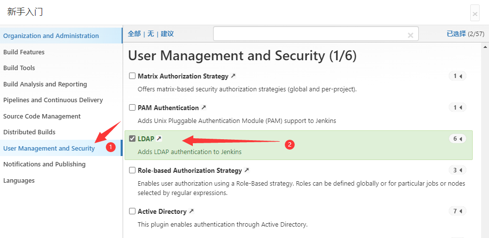

## Jenkins
### 使用Docker运行jenkins

``` bash
# 使用docker运行jenkins，并设置插件源为清华大学
# Windows下运行，请将每后结尾的 \ 替换为 ^
docker run -itd  --name jenkins --privileged --restart always --privileged=true \
-e TZ=Asia/Shanghai \
-e JENKINS_UC_DOWNLOAD=https://mirrors.tuna.tsinghua.edu.cn/jenkins/updates/update-center.json \
-p 9999:8080 -p 50000:50000 \
jenkins/jenkins:lts-jdk11

```

打开浏览器进入jenkins界面 http://localhost:9999    
输入密码

``` bash
# 进入jenkins容器
docker exec -it jenkins bash

# 查看jenkins默认密码，使用默认密码登录jenkins
more /var/jenkins_home/secrets/initialAdminPassword


```


### 安装LDAP插件

- 初次进入自由选择插件时选择


- 进入Jenkins后选择


### Jenkins设置LDAP

- Server : ldap://localhost:389
- root DN : dc=example,dc=com
- Group search base : ou=Staff, ou=Groups, o=demo
- Manager DN : cn=jenkins, dc=example, dc=com
- Display Name LDAP attribute : cn
- Email Address LDAP attribute : uid


## gitlab

todo……
