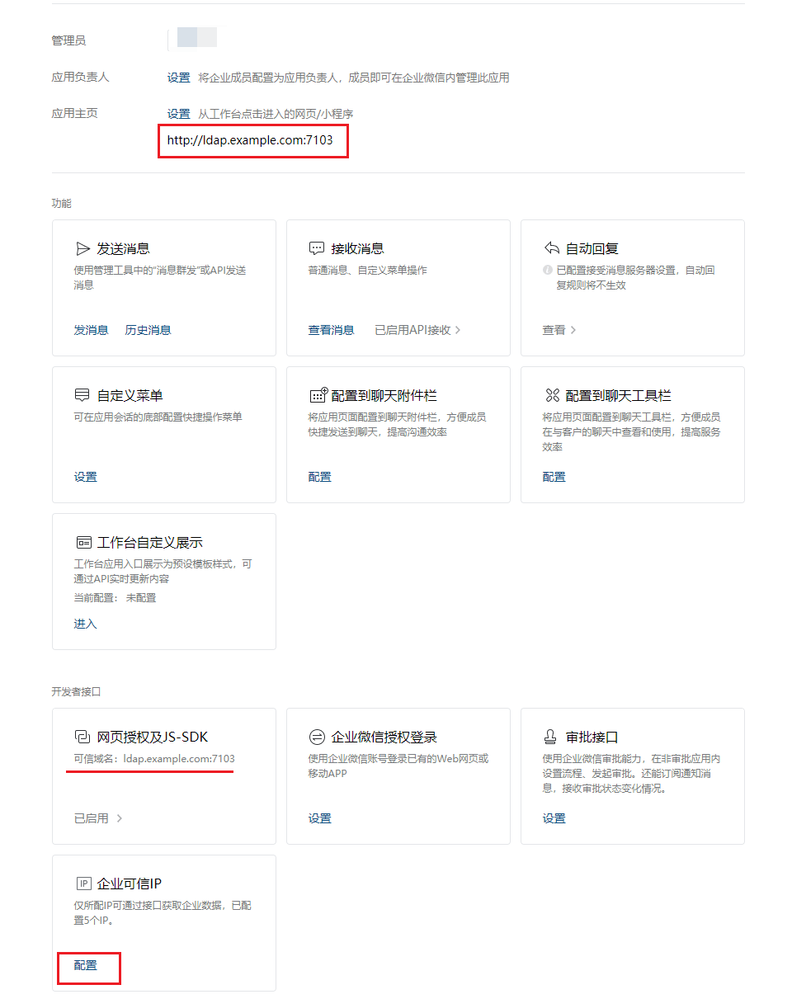

## 企业微信开放平台配置

### 注册应用

在 [企业微信 应用管理](https://work.weixin.qq.com/wework_admin/frame#/apps) 中创建应用

### 应用配置

- 应用主页
- 网页授权及JS-SDK可信域名
- 企业可信IP

### 审批

- [概述](https://developer.work.weixin.qq.com/document/path/91854)
- [提交审批申请](https://developer.work.weixin.qq.com/document/path/91853)
- [审批申请状态变化回调通知](https://developer.work.weixin.qq.com/document/path/91815)
